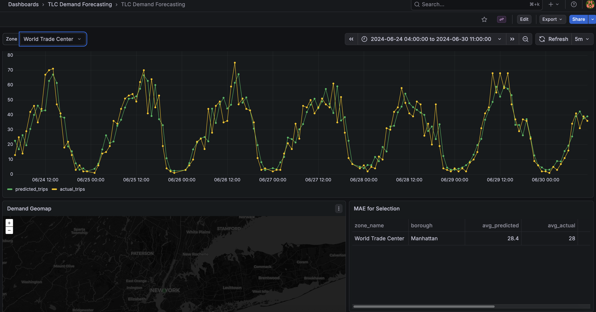
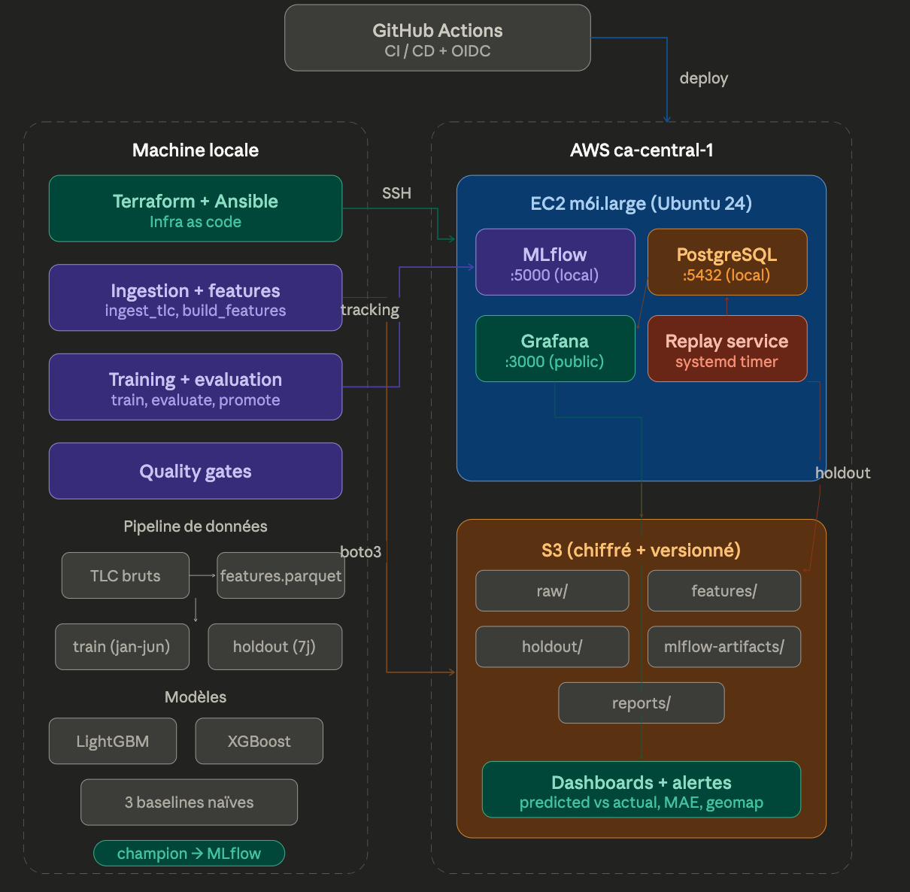

# TLC Demand Forecasting MLOps

Portfolio MLOps project to forecast TLC taxi demand at the `zone x hour` level, track experiments in MLflow, promote a guarded `champion` model, replay a frozen historical holdout as pseudo-live traffic, and surface predictions, observations, and errors in Grafana.

This repository is designed as an end-to-end system, not as a notebook demo:

- infrastructure provisioning with Terraform
- server configuration with Ansible
- data and ML pipelines in Python scripts
- experiment tracking and model registry with MLflow
- business and operational dashboards with Grafana
- GitHub Actions CI/CD for `staging` and `production`

The execution runbook lives in [DEPLOYMENT.md](DEPLOYMENT.md). This README is the high-level guide to the system, the architecture, the ML choices, and the data journey.

## Preview

Example of the business dashboard for a selected zone:



## 1. What this project demonstrates

The project answers one practical question:

> Can we build a credible MLOps stack that goes from raw public taxi data to a business dashboard, with explicit model validation and promotion rules?

Here, the answer is yes, with three important constraints:

- the public TLC source is not a true real-time feed, so the project uses historical replay
- MLflow is intentionally private and accessed through an SSH tunnel
- model promotion is not based on the prettiest score, but on baselines, a frozen holdout, and quality gates

## 2. Architecture Overview

Deployed architecture overview:



### Simple view

```text
                           +----------------------+
                           |   GitHub Actions     |
                           |  CI + CD + OIDC AWS  |
                           +----------+-----------+
                                      |
                                      v
+--------------------+      +-----------------------------+
| Local machine      |      | AWS staging / production    |
|                    |      |                             |
| - TLC ingestion    |      | - EC2 m6i.large            |
| - feature build    |----->| - PostgreSQL               |
| - training         | SSH  | - MLflow (localhost:5000)  |
| - evaluation       |      | - Grafana (:3000)          |
| - promotion        |      | - replay systemd timer     |
| - terraform        |      | - IAM role                 |
| - ansible          |      | - Security Group           |
+---------+----------+      +-------------+---------------+
          |                                 |
          |                                 v
          |                     +---------------------------+
          +-------------------->| S3                        |
                                | - raw/                    |
                                | - features/               |
                                | - holdout/                |
                                | - mlflow-artifacts/       |
                                | - reports/                |
                                +---------------------------+
```

### Data flow

```text
Monthly TLC parquet files
    + taxi_zone_lookup.csv
    + taxi_zones shapefile
            |
            v
scripts/ingest_tlc.py
scripts/build_zone_centroids.py
            |
            v
data/raw/*
            |
            v
scripts/build_features.py
    -> aggregate by zone x hour
    -> build calendar features
    -> build lag and rolling features
    -> split train / holdout
            |
            +------------------> data/processed/train_features.parquet
            +------------------> data/holdout/holdout_features.parquet
            |
            v
scripts/train_models.py
    -> baselines
    -> LightGBM
    -> XGBoost
    -> MLflow runs
            |
            v
scripts/evaluate_models.py
    -> reports/run_summary.csv
    -> reports/best_run.json
            |
            v
scripts/promote_champion.py
    -> MLflow Registry alias: champion
    -> reports/promotion_decision.json
            |
            v
prediction_service/run_replay_cycle.py
    -> reads holdout
    -> loads models:/...@champion
    -> predicts one hour at a time
    -> compares to frozen actuals
    -> writes to PostgreSQL
            |
            v
Grafana
    -> geomap
    -> predicted vs actual
    -> MAE views
    -> alerting
```

## 3. End-to-End Data Journey

### Phase 1. Raw ingestion

[`scripts/ingest_tlc.py`](scripts/ingest_tlc.py) downloads official TLC files by month and, when requested, uploads them to S3.

What it does:

- downloads `yellow_tripdata_YYYY-MM.parquet`
- downloads `taxi_zone_lookup.csv`
- writes everything into `data/raw/`
- can upload to `s3://.../raw/`

Why this phase exists:

- to separate the raw source from the rest of the pipeline
- to make feature rebuilds reproducible
- to keep a simple artifact that can be audited

### Phase 2. Geographic enrichment

[`scripts/build_zone_centroids.py`](scripts/build_zone_centroids.py) downloads the official taxi zone shapefile, computes one centroid per zone, and writes `data/raw/taxi_zone_centroids.csv`.

What it does:

- downloads `taxi_zones.zip`
- converts coordinates from `EPSG:2263` to `EPSG:4326`
- computes `latitude` and `longitude` per `LocationID`
- makes the Grafana geomap meaningful

Why this phase exists:

- `taxi_zone_lookup.csv` does not contain coordinates
- without centroids, the map is incomplete or empty

### Phase 3. Model dataset build

[`scripts/build_features.py`](scripts/build_features.py) is the core of data preparation.

What it does:

- reads raw parquet files through DuckDB
- aggregates pickups into `target_trips` by `zone_id x hour`
- filters out timestamps that fall outside the month bounds implied by the raw filenames
- enriches rows with `zone_name`, `borough`, `latitude`, and `longitude`
- builds temporal and historical features
- writes:
  - `data/processed/features.parquet`
  - `data/processed/train_features.parquet`
  - `data/holdout/holdout_features.parquet`

Why this phase exists:

- to turn individual trips into a tabular forecasting problem
- to prepare a frozen final holdout that is never used for fitting
- to produce the exact same schema for both training and replay

### Current data window

The repository currently uses `6 months` of `yellow taxi` data:

- `January 2024`
- `February 2024`
- `March 2024`
- `April 2024`
- `May 2024`
- `June 2024`

The resulting dataset covers:

- full features: `2024-01-01 00:00:00` -> `2024-06-30 23:00:00`
- training: `2024-01-01 00:00:00` -> `2024-06-23 23:00:00`
- holdout: `2024-06-24 00:00:00` -> `2024-06-30 23:00:00`

In plain terms:

- the model learns on `January 1 -> June 23`
- it is then evaluated on a hidden week `June 24 -> June 30`
- that same week is replayed into Grafana as pseudo-live traffic

### Phase 4. Challenger training

[`scripts/train_models.py`](scripts/train_models.py) trains and compares the candidate models.

What it does:

- loads `train_features.parquet` and `holdout_features.parquet`
- validates temporal integrity
- creates an expanding-window cross-validation scheme
- logs the baseline models first
- trains the challenger models next
- writes metrics and artifacts to MLflow

Why this phase exists:

- to avoid misleading random splits
- to compare complex models against simple references
- to keep a usable MLflow history

### Phase 5. Evaluation and report export

[`scripts/evaluate_models.py`](scripts/evaluate_models.py) extracts a readable summary from MLflow.

What it does:

- loads completed runs
- ranks eligible runs by holdout performance
- exports:
  - [`reports/run_summary.csv`](reports/run_summary.csv)
  - [`reports/best_run.json`](reports/best_run.json)

Why this phase exists:

- to create a diffable summary outside the MLflow UI
- to support CI quality gates without depending on manual UI inspection

### Phase 6. Champion promotion

[`scripts/promote_champion.py`](scripts/promote_champion.py) does not simply promote the best score. It applies hard gates.

What it does:

- reads eligible MLflow runs
- identifies the best challenger among `lightgbm` and `xgboost`
- checks that it:
  - beats the best baseline
  - satisfies `holdout_mase < 1`
  - does not regress versus the current champion
- registers the model in MLflow Registry
- updates the `candidate` alias
- updates the `champion` alias only if all gates pass
- exports [`reports/promotion_decision.json`](reports/promotion_decision.json)

Why this phase exists:

- to create release governance
- to make model promotion explainable
- to prevent silent degradations

### Phase 7. Pseudo-live replay

[`prediction_service/run_replay_cycle.py`](prediction_service/run_replay_cycle.py) simulates a production-like stream from the frozen holdout.

What it does:

- loads the holdout hour by hour
- loads `models:/tlc-demand-forecasting@champion`
- predicts the current hour
- copies the real target from the holdout as `actual_trips`
- computes `absolute_error`
- writes rows into PostgreSQL

Why this phase exists:

- the public TLC source is not a live event stream
- the project still needs a realistic monitoring story
- replay closes the loop between training and observability

### Phase 8. Dashboarding and alerting

Grafana reads PostgreSQL and exposes both business and operational dashboards.

Business dashboard:

- `Predicted vs Actual`
- `Demand Geomap`
- `MAE for Selection`

Operations dashboard:

- replay freshness
- latest batch size
- 24h MAE
- replay rows over time

Alerting is provisioned from files and not created manually in the UI.

## 4. Why each building block exists

| Building block | Main files | What it does | Why it exists |
| --- | --- | --- | --- |
| Terraform | [`terraform/main.tf`](terraform/main.tf) | creates EC2, EIP, S3, IAM, Security Groups, OIDC | makes infrastructure reproducible |
| Ansible base | [`ansible/playbooks/site.yml`](ansible/playbooks/site.yml) | installs and configures the Ubuntu server | avoids manual setup |
| PostgreSQL playbook | [`ansible/playbooks/postgresql.yml`](ansible/playbooks/postgresql.yml) | creates databases, users, and schema | backs MLflow and replay data |
| MLflow playbook | [`ansible/playbooks/mlflow.yml`](ansible/playbooks/mlflow.yml) | installs MLflow and systemd service | tracks experiments and registry state |
| Grafana playbook | [`ansible/playbooks/grafana.yml`](ansible/playbooks/grafana.yml) | installs Grafana, datasource, dashboards, alerts | provides business and ops visibility |
| Replay timer playbook | [`ansible/playbooks/prediction_timer.yml`](ansible/playbooks/prediction_timer.yml) | deploys replay service and timer | simulates production flow |
| Ingestion | [`scripts/ingest_tlc.py`](scripts/ingest_tlc.py) | downloads TLC parquet files | freezes the raw source |
| Geography | [`scripts/build_zone_centroids.py`](scripts/build_zone_centroids.py) | computes zone centroids | feeds the geomap |
| Feature engineering | [`scripts/build_features.py`](scripts/build_features.py) | builds the training dataset | turns raw trips into supervised rows |
| Training | [`scripts/train_models.py`](scripts/train_models.py) | trains baselines and challengers | compares candidates correctly |
| Evaluation | [`scripts/evaluate_models.py`](scripts/evaluate_models.py) | exports readable reports | supports review and CI gates |
| Promotion | [`scripts/promote_champion.py`](scripts/promote_champion.py) | updates `candidate` and `champion` | governs model release |
| Quality gates | [`scripts/check_quality.py`](scripts/check_quality.py) | applies versioned thresholds | blocks silent regressions |
| Replay service | [`prediction_service/run_replay_cycle.py`](prediction_service/run_replay_cycle.py) | generates predictions and actuals | closes the monitoring loop |

## 5. ML Design: What, How, and Why

### Prediction unit

The system predicts one thing:

- a TLC zone
- at a specific hour
- with a target called `target_trips`

So the project does not predict:

- an individual ride
- a destination
- a fare
- a waiting time

It predicts an aggregate demand volume.

Examples:

- `2024-06-24 08:00:00`, zone `JFK Airport` -> expected trip volume for that hour
- `2024-06-28 18:00:00`, zone `Penn Station/Madison Sq West` -> another hourly demand prediction

The meaning of the dashboard columns is:

- `predicted_trips`: model estimate for `zone x hour`
- `actual_trips`: real holdout value for the same `zone x hour`
- `absolute_error`: `abs(predicted_trips - actual_trips)`

Important:

- `actual_trips` is not simulated
- it comes directly from the frozen holdout loaded by [`prediction_service/run_replay_cycle.py`](prediction_service/run_replay_cycle.py)

### Features used

Main feature groups:

- calendar: `hour_of_day`, `day_of_week`, `day_of_month`, `month`, `is_weekend`
- cyclical encodings: `hour_sin`, `hour_cos`, `dow_sin`, `dow_cos`
- lags: `lag_1h`, `lag_2h`, `lag_24h`, `lag_168h`
- rolling statistics: `rolling_mean_6h`, `rolling_mean_24h`, `rolling_std_24h`
- short-term trend: `trend_ratio`

Why these features:

- calendar variables capture recurring time patterns
- `lag_24h` captures daily seasonality
- `lag_168h` captures weekly seasonality
- rolling statistics stabilize noisy hourly counts

### Baselines

The pipeline always logs required baselines first:

- `seasonal_naive_24h`
- `seasonal_naive_168h`
- `rolling_mean_24h`

Why this matters:

- if a complex model cannot beat a naive reference, it should not be promoted
- `lag_24h` and `lag_168h` are natural hourly forecasting references

### Challenger models

The current challengers are:

- `lightgbm`
- `xgboost`

Why tree-based tabular models:

- the problem is structured and feature-driven
- the dataset is medium-sized and fits well in this approach
- the models are strong baselines for tabular forecasting without adding unnecessary serving complexity

### Validation protocol

The project does not use a random split.

Validation is:

- expanding-window cross-validation on the training set
- plus one frozen final holdout over the last `7 days`

Why the holdout is the last `7 days`:

- the prediction grain is hourly
- `7 days` covers a full weekly cycle
- it matches the weekly signal captured by `lag_168h`
- it keeps most of the data available for fitting

The exact split logic is implemented in [`scripts/build_features.py`](scripts/build_features.py) through `--holdout-hours`, which currently defaults to `24 * 7`.

### Metrics

Tracked metrics:

- `MAE`
- `RMSE`
- `MASE`

Interpretation:

- `MAE` is the average absolute miss in trips per `zone x hour`
- `RMSE` penalizes larger misses more strongly
- `MASE < 1` means the model beats a naive seasonal reference

### Current champion

Current snapshot from [`reports/best_run.json`](reports/best_run.json):

- model: `lightgbm`
- MLflow registry version: `4`
- `holdout_mae = 6.4256`
- `holdout_rmse = 14.3644`
- `holdout_mase = 0.4161`
- improvement versus best baseline holdout MAE: `+46.34%`

Quick comparison:

- `lightgbm` holdout MAE: `6.4256`
- `xgboost` holdout MAE: `6.4413`
- best baseline holdout MAE: `11.9738`

Production sanity check on `2026-03-15`:

- replayed rows: `20574`
- replay window: `2024-06-24 00:00:00` -> `2024-06-30 23:00:00`
- mean `predicted_trips`: `39.27`
- mean `actual_trips`: `39.38`
- mean bias: `-0.11`
- total predicted trips: `807883`
- total actual trips: `810193`
- correlation `predicted vs actual`: `0.9817`

Interpretation:

- predictions follow the overall demand shape well
- the current champion has a slight under-prediction bias
- the largest misses still happen around some demand peaks, but the behavior is coherent

## 6. How the System Decides a Model Is Acceptable

Promotion is blocked unless the challenger:

- beats the best baseline on the final holdout
- satisfies `holdout_mase < 1`
- beats the currently promoted champion on the same holdout

Current versioned thresholds live in:

- [`config/quality_gates.json`](config/quality_gates.json)
- [`scripts/check_quality.py`](scripts/check_quality.py)

Typical rules:

- `holdout_mae <= 8.0`
- `holdout_mase <= 1.0`
- improvement versus best baseline `>= 10%`

This is why the project is closer to a real production workflow than a simple notebook benchmark.

## 7. What Actually Runs on AWS

Current deployment assumptions:

- region: `ca-central-1`
- separate `staging` and `production`
- EC2 sizing aligned on `m6i.large`
- Grafana public on port `3000`
- MLflow private on `localhost:5000`
- PostgreSQL private on `localhost:5432`

### Databases

Two PostgreSQL databases are used:

- `mlflow` for experiment tracking metadata
- `predictions` for replay state and dashboard tables

Main business table:

- `zone_predictions`

This table stores:

- prediction time
- zone
- predicted volume
- actual volume
- absolute error
- model version and alias

## 8. CI/CD and Environments

GitHub Actions workflows:

- [`.github/workflows/ci.yml`](.github/workflows/ci.yml)
- [`.github/workflows/deploy-staging.yml`](.github/workflows/deploy-staging.yml)
- [`.github/workflows/deploy.yml`](.github/workflows/deploy.yml)
- [`.github/workflows/deploy-reusable.yml`](.github/workflows/deploy-reusable.yml)

Environment logic:

- `staging` deploys automatically on `push` to `main`
- `production` deploys from immutable `prod-v*` tags
- `workflow_dispatch` remains available as break-glass for production
- AWS auth is handled through GitHub OIDC, not static AWS keys in GitHub

## 9. How to Read the Grafana Dashboard

Main business dashboard:

- `Predicted vs Actual`
- `Demand Geomap`
- `MAE for Selection`

How to interpret the main panel:

- x-axis: time
- y-axis: number of trips
- green line: `predicted_trips`
- yellow line: `actual_trips`

If the zone selection changes:

- the business panels follow the selected zone
- if Grafana still carries an old zone that no longer exists in the current holdout, the dashboard now falls back safely to `All`

Important nuance:

- the replay is historical, not real future inference
- Grafana shows predictions on a hidden holdout week, compared against real observed values from that same week

## 10. Repository Layout

Main directories:

| Path | Purpose |
| --- | --- |
| [`terraform/`](terraform/) | infrastructure |
| [`ansible/`](ansible/) | server configuration, dashboards, alerts |
| [`scripts/`](scripts/) | ingestion, features, training, evaluation, promotion, quality gates |
| [`prediction_service/`](prediction_service/) | replay service and SQL schema |
| [`databricks/`](databricks/) | optional notebooks |
| [`reports/`](reports/) | exported ML decisions and summaries |
| [`img/`](img/) | README screenshots and architecture visuals |

## 11. Useful Commands

Create the local environment:

```bash
python3 -m venv .venv
source .venv/bin/activate
pip install --upgrade pip
pip install -r requirements/local.txt
```

Ingest and prepare data:

```bash
python scripts/build_zone_centroids.py --upload-s3 --s3-bucket "$S3_BUCKET"
python scripts/ingest_tlc.py --year 2024 --months 1 2 3 4 5 6 --upload-s3 --s3-bucket "$S3_BUCKET"
python scripts/build_features.py --upload-s3 --s3-bucket "$S3_BUCKET"
```

Train and promote:

```bash
export MLFLOW_TRACKING_URI=http://127.0.0.1:5000
python scripts/train_models.py
python scripts/evaluate_models.py
python scripts/promote_champion.py
```

Replay and checks:

```bash
make replay-backfill
make test
make quality-gates
make tf-validate
make ansible-syntax
```

## 12. Known Limitations

Known limits of the current design:

- no true TLC real-time stream
- no low-latency online prediction API
- no dedicated feature store
- no multi-fold backtesting dashboard in Grafana
- no Kubernetes or large-scale distributed training

These are conscious scope choices, not hidden gaps.

## 13. Role of Databricks

The Databricks notebooks are optional and not on the critical production path:

- [`databricks/01_eda.py`](databricks/01_eda.py)
- [`databricks/02_feature_prototype.py`](databricks/02_feature_prototype.py)
- [`databricks/03_sandbox_training.py`](databricks/03_sandbox_training.py)

They exist for:

- exploratory analysis
- feature prototyping
- demo notebooks

The deployed pipeline does not depend on Databricks.
